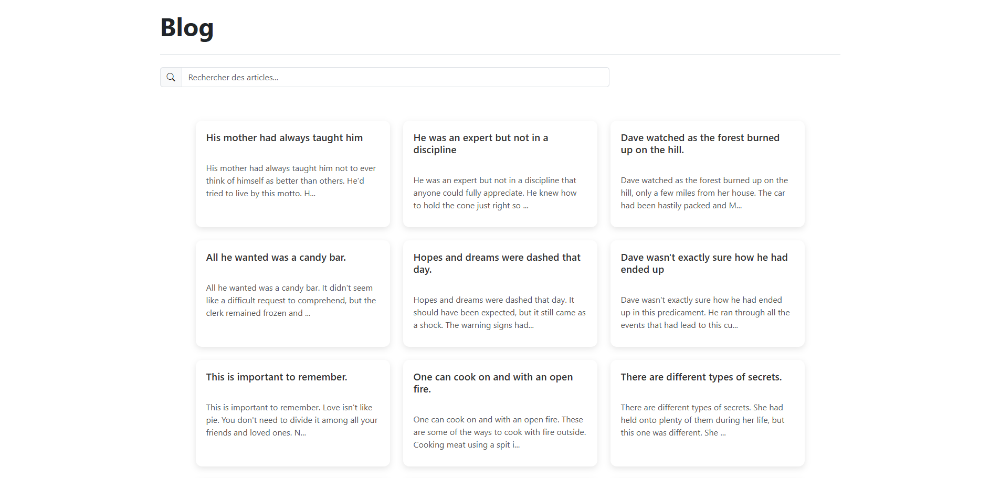
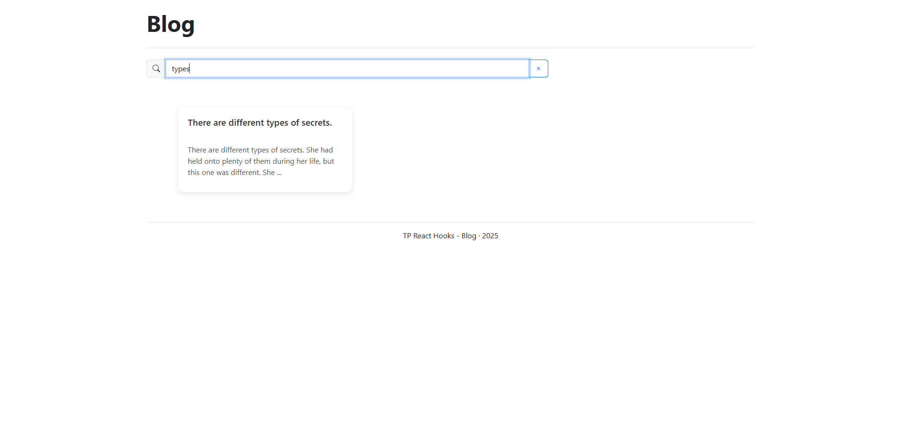
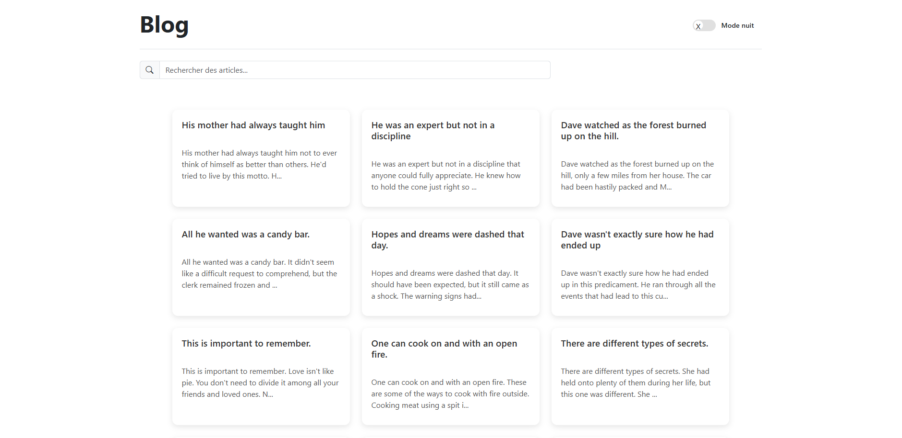
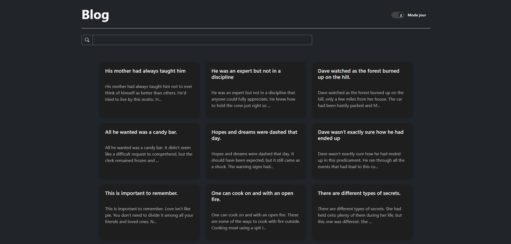
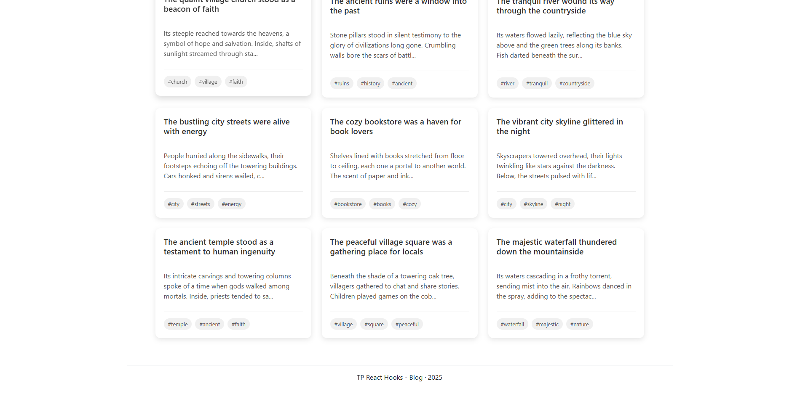
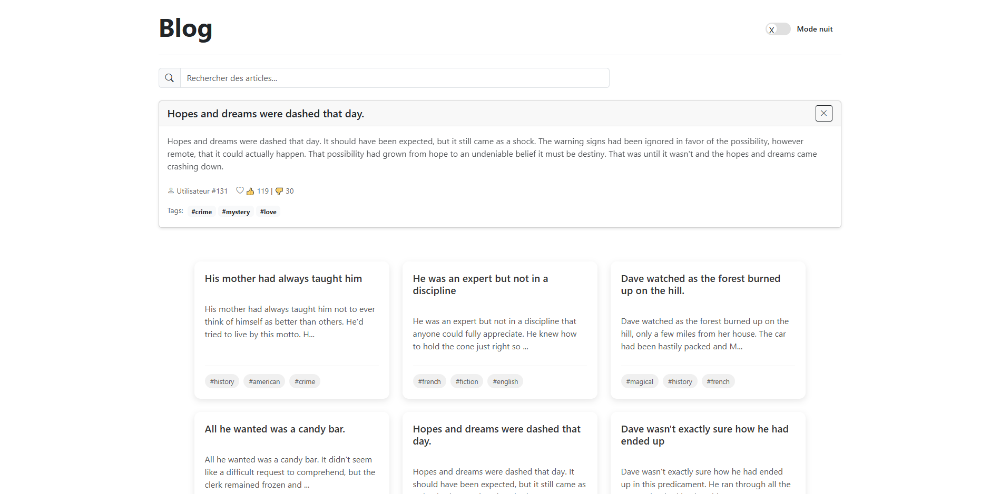
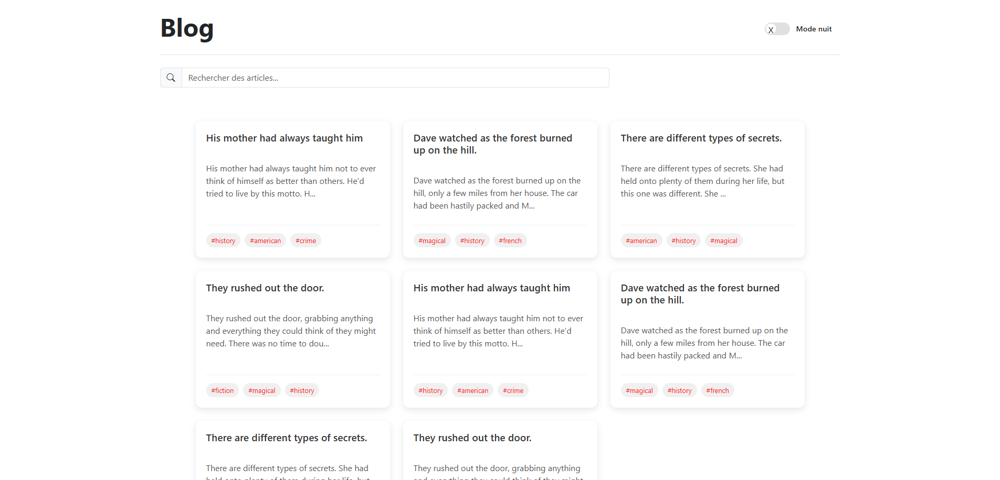
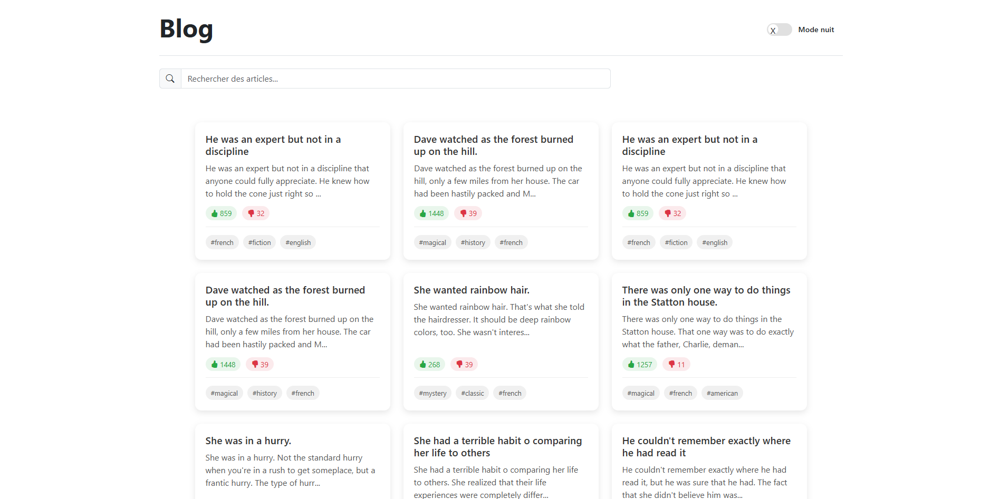

# TP React Hooks - Application de Blog

Ce TP a pour objectif de mettre en pratique l'utilisation des Hooks React (useState, useEffect, useCallback, useMemo) ainsi que la création de Hooks personnalisés à travers une application de blog simple.

## Installation et configuration initiale

1. Cloner le dépôt :
```bash
git clone https://github.com/pr-daaif/tp-react-hooks-blog.git
cd tp-react-hooks-blog
```

2. Créer votre propre dépôt sur Github et changer le remote :
```bash
# Supprimer le remote origine
git remote remove origin

# Ajouter votre nouveau remote
git remote add origin https://github.com/[votre-username]/tp-react-hooks-blog.git

# Premier push
git push -u origin main
```

3. Installer les dépendances :
```bash
npm install
```

4. Lancer l'application :
```bash
npm start
```

## Instructions pour le TP

Pour chaque exercice :
1. Lisez attentivement l'énoncé
2. Implémentez la solution
3. Testez votre implémentation (pensez à faire des copies d'écran)
4. Mettez à jour la section correspondante dans ce README avec :
   - Une brève explication de votre solution
   - Des captures d'écran montrant le fonctionnement
   - Les difficultés rencontrées et comment vous les avez résolues
5. Commitez vos changements avec un message descriptif

### Exercice 1 : État et Effets 
#### Objectif : Implémenter l'affichage et la recherche de posts

- [X] 1.1 Compléter le hook `usePosts` pour récupérer les posts depuis l'API dummyjson.com
- [X] 1.2 Implémenter le composant `PostList` pour afficher les posts
- [X] 1.3 Ajouter la fonctionnalité de recherche par titre ou contenu dans `PostSearch`
- [X] 1.4 Documenter votre solution ici

### Réalisation de l'exercice 1 :

  J'ai implémenté la récupération des posts depuis l'API **dummyjson.com** en utilisant :  
  
  - Le hook `usePosts` avec `useState` et `useEffect` pour charger et filtrer les données.
    
  - Le composant `PostList` pour afficher les posts (titre + extrait).
    
  - La recherche via `PostSearch`, qui interroge l'API avec `/posts/search?q={term}`.
  
  - Gestion des états `loading` et `error` pour une meilleure expérience utilisateur.  


## Captures d'écran :
### Capture de l'affichage des posts


### 🔍 Capture de la barre de recherche fonctionnelle



### Exercice 2 : Hooks Personnalisés
#### Objectif : Créer des hooks réutilisables

- [X] 2.1 Créer le hook `useDebounce` pour optimiser la recherche
- [X] 2.2 Créer le hook `useLocalStorage` pour persister les préférences utilisateur
- [X] 2.3 Utiliser ces hooks dans l'application
- [X] 2.4 Documenter votre solution ici

  2.1 - J'ai créé le hook useDebounce qui utilise un délai de 500ms pour éviter d'appeler l'API à chaque frappe dans le champ de recherche. Il est utilisé dans le hook usePosts pour limiter les requêtes inutiles.
  
  2.2 - J'ai créé le hook useLocalStorage qui permet de sauvegarder une valeur dans le localStorage. Il est utilisé dans App.jsx pour mémoriser le mode de défilement choisi par l’utilisateur.
  
  2.3 - Les deux hooks sont utilisés dans l'application :
  
  useDebounce : dans usePosts.js, pour attendre que l’utilisateur ait fini de taper avant de déclencher la recherche.
  
  useLocalStorage : dans App.jsx, pour enregistrer la préférence de scroll (préparation à l'exercice 4) et dans ThemeContext.js (préparation exercice 3).


### Exercice 3 : Optimisation et Context
#### Objectif : Gérer le thème global et optimiser les rendus

- [X] 3.1 Créer le `ThemeContext` pour gérer le thème clair/sombre
- [X] 3.2 Implémenter le composant `ThemeToggle`
- [X] 3.3 Utiliser `useCallback` et `useMemo` pour optimiser les performances
- [X] 3.4 Documenter votre solution ici

##### J'ai implémenté la gestion du thème et optimisé les performances de l'application :
### ThemeContext :

  Création d'un contexte global pour gérer le thème clair/sombre
  
  Mise en place d'un Provider autour de l'application
  
  Export des fonctions utilitaires via useTheme()

### ThemeToggle :

  Composant basique avec un switch UI
  
  Intégration fluide avec le contexte
  
  Mise à jour en temps réel de l'interface

### Optimisations :

  useCallback pour stabiliser les handlers (clic, recherche)
  
  useMemo pour les calculs coûteux (tags uniques)
  
  React.memo sur les composants principaux

## Captures d'écran :
### Blog page avec le bouton ThemeToggle visible


### Blog page en mode sombre (dark mode)


### Champ de recherche optimisé (déclenche la recherche avec un debounce)


### Exercice 4 : Fonctionnalités avancées
#### Objectif : Ajouter des fonctionnalités de chargement et détail

- [X] 4.1 Implémenter le chargement infini des posts avec `useIntersectionObserver`
- [X] 4.2 Créer le composant `PostDetails` pour afficher les détails d'un post
- [X] 4.3 Ajouter la fonctionnalité de filtrage par tags
- [X] 4.4 Documenter votre solution ici

### ⚡ Chargement Infini
   Technologie : useIntersectionObserver
    
   Fonctionnement :
    
  Détection automatique du bas de page
    
   Chargement déclenché seulement si :
    
  Scroll infini activé
    
   Posts disponibles (hasMore)
    
  Pas de chargement en cours
    
  Alternative : Bouton "Voir plus" si désactivé 

### 📱 Détails des Posts
  Contenu :
  
  Titre complet + corps de l'article
  
  Système de réactions (likes)
  
  Tags cliquables (#hashtag)
  
  Bouton de fermeture
  
  Optimisation : React.memo pour performances

### 🔍 Filtrage par Tags
  Interaction :
  
  Cliquez sur un tag pour filtrer
  
  Tag stocké dans selectedTag
  
  Bouton de réinitialisation
  
  Compatibilité : Fonctionne avec le scroll infini

### ⚙️ Optimisations Clés
  useCallback : Stabilise les handlers d'événements
  
  useMemo : Calcule les tags uniques efficacement
  
  React.memo : Évite les rendus inutiles

## Captures d'écran :

### ⚡ Chargement infini des posts (scroll jusqu’en bas)


### 📱 Détails d’un post sélectionné avec réactions et tags


### 🔍 Filtrage des posts par tag sélectionné (#history)


## ✅  Résultat final
Une application fluide avec chargement progressif, navigation détaillée, et filtrage dynamique par tags

Une expérience optimisée côté utilisateur avec un code modulaire et réutilisable




## Ressources utiles

### Post unique

```json
{
  "id": 1,
  "title": "His mother had always taught him",
  "body": "His mother had always taught him not to ever think of himself as better than others. He'd tried to live by this motto. He never looked down on those who were less fortunate or whose decisions had led them astray.",
  "userId": 9,
  "tags": ["history", "american", "crime"],
  "reactions": 2
}
```

## Conseils d'utilisation

- Pour la pagination, utilisez les paramètres `limit` et `skip`
- Pour calculer le nombre total de pages, utilisez la formule : `Math.ceil(total / limit)`
- Pour implémenter le défilement infini, chargez plus de posts quand l'utilisateur atteint le bas de la page
- Pour la recherche, utilisez le point d'entrée `/posts/search` avec le paramètre `q`
- Vous pouvez combiner les paramètres de recherche avec les paramètres de pagination